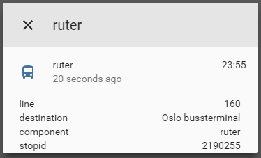

# custom_component to get info about next departures.
    
A platform which allows you to get information about next departure from spesified stop.
  
To get started put `/custom_components/sensor/ruter.py` here:
`<config directory>/custom_components/sensor/ruter.py`  
  
**Example configuration.yaml:**
```yaml
sensor:
  platform: ruter
  stopid: 129302
  destination: 'Sandvika (Bussterminal)'
```
**Configuration variables:**  
  
key | description  
:--- | :---  
**platform (Required)** | The platform name.  
**stopid (Required)** | The ID of the stop you are monitoring.  
**destination (Optional)** | The destination stop of the line you want to monitor.  
#### Sample overview

  
[Home-Assistant demo site.](https://ha-test-ruter.halfdecent.io/)
  
This component is using the [Ruter reisapi API](http://reisapi.ruter.no/Help) to get the information.
 This component is only usefull for users living near Oslo, Norway that uses Ruter for transportation.
 To find the stopid go to https://ruter.no/reiseplanlegger/Stoppested and search for your stop.
 in the url after you have searched there will be an ID right after the 'Stoppested/' in a format like this (129302), the numbers there is what you need to put in the `stopid:` config option.
 The `destionation:` can be used to filter the responses, the name must be exactly the same as on the ruter.no site.  
